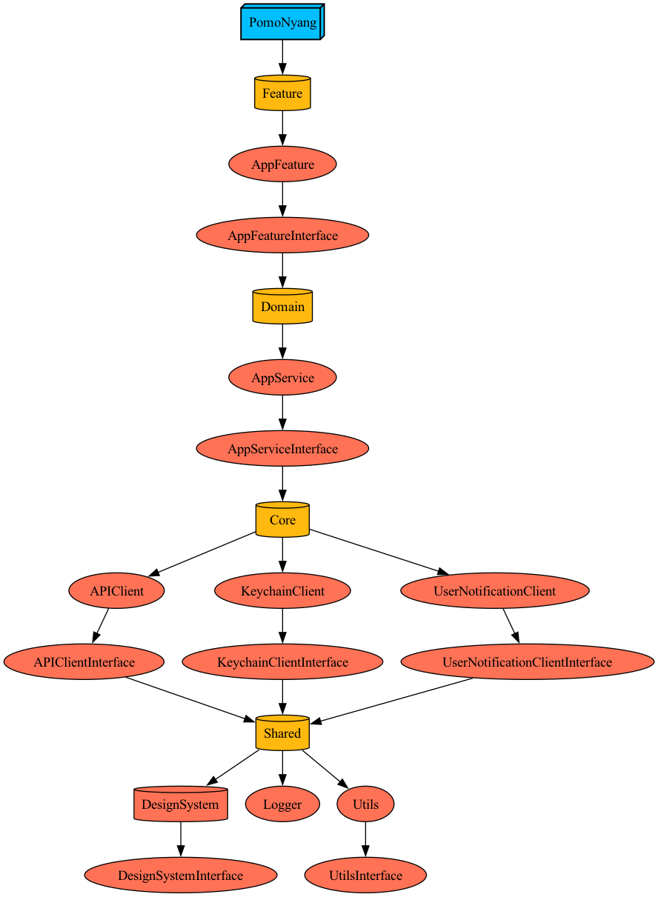
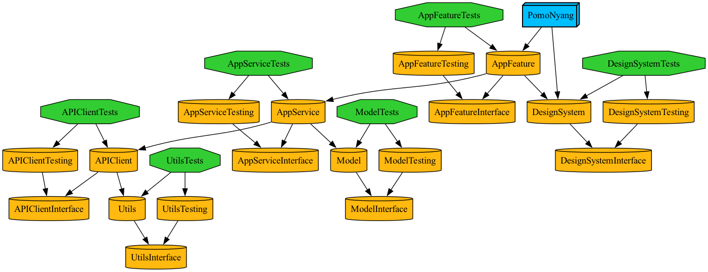

# PomoNyang iOS 앱

### 환경 구성
- Carthage 설치 (XCFramework로 관리중인 외부 라이브러리 대응)
  - ```brew install carthage```
- Tuist 설치
  - [mise 설치 (개발도구 관리툴)](https://github.com/jdx/mise?tab=readme-ov-file#quickstart)
  - ```mise install tuist``` (프로젝트 루트 경로에서)

### 프로젝트 생성
- 개발환경 생성
  - ```make dev```
- 운영환경 생성
  - ```make prod```

### Tuist
- Manifests 생성
  - ```make manifests```
- 외부 라이브러리 구성
  - ```make install```
- 프로젝트 변경 사항 반영 및 열기 (target: 타겟명)
  - ```make generate target="{target_name}"```
- 외부 의존성 캐시 생성 (target: 타겟명)
  - ```make cache target="{target_name}"```
- 모듈 생성 (layer: 경로, name: 모듈명)
  - ```make module layer="{layer_path}" name="{module_name}"```
- 외부라이브러리, .xcworkspace, .xcodeproj 파일 제거
  - ```make clean```

### 스크립트
- 그래프 생성 (Example, ThirdParty, Dev, Tests 타겟 제외)
  - ```make graph```
- Xcode 파일 생성 템플릿 추가
  - ```make template```

### 의존성 그래프 (외부의존성 제외)
- 운영 환경

- 개발 환경
